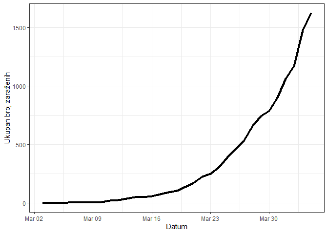
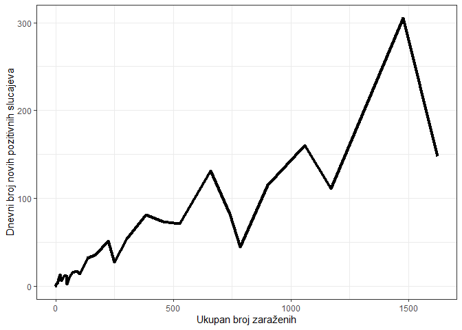

Analiza situacije u Srbiji
--------------------------

\#\#\#\#\#\#izvori: covid19.rs

Ovaj dokument predstavlja nezvaničnu analizu broja obolelih od COVID-19
na teritoriji Srbije. Cilj analize je da se predstave dnevne promene i
trendovi promena brojeva obolelih, smrtnih slučajeva i broja testiranih
ljudi koji su ispunjavali definiciju slučaja. Takođe, ovaj dokument ima
za cilj predstavljanje promena broja zaraženih u Srbiji u svetlu promena
u regionu i trenutnim žarištima pandemije u Evropi. Podaci korišćeni za
preliminarnu analizu su preuzeti sa izveštaja sajta covid19.rs. Izvori
ostalih podataka korišćenih za analizu su istaknuti ispod naslova
analize.

#### Ukupan broj potvrdjenih slučajeva



\#\#\#\#Ukupan broj potvrdjenih slučajeva (log10)


#### Ukupan pozitivnih broj u odnosu na dnevni rast pozitivnih slučajeva



#### Dnevna promena rasta pozitivnih slučajeva

\#\#\#\#\#\#crvena linija označava stopu rasta 1.1 puta


#### Promena broja pozitivnih slučajeva u odnosu na broj testiranih


#### Promena broja testiranih slučajeva na dnevnom nivou


#### Odnos broja negativnih (crvena linija) broja pozitivnih slučajeva (zelena liniija)


#### Procenat smrtnosti u zavisnosti od promene broja pozitivnih slučajeva


### Broj povrđenih slučajeva u regionu

\#\#\#\#\#\#izvori: covid19.rs, worldometers.info,
<a href="https://gisanddata.maps.arcgis.com/apps/opsdashboard/index.html#/bda7594740fd40299423467b48e9ecf6" class="uri">https://gisanddata.maps.arcgis.com/apps/opsdashboard/index.html#/bda7594740fd40299423467b48e9ecf6</a>


\#\#\#Broj smrtnih slučajeva u regionu


### Rast broja zaraženih u odnosu na trenutna žarišta u Evropi (do 4. Aprila 2020)

#### Horizontalne linije predstavljaju momenat uvođenja restrikcija/vanrednog stanja

\#\#\#\#\#\#izvori: covid19.rs, worldometers.info, swissinfo.ch


\#\#\#\#\#Rast broja zaraženih u odnosu na trenutna žarišta u Evropi,
log10 skala(do 4. Aprila 2020)


``` r
sessionInfo()
```

    ## R version 3.6.3 (2020-02-29)
    ## Platform: x86_64-w64-mingw32/x64 (64-bit)
    ## Running under: Windows 10 x64 (build 18363)
    ## 
    ## Matrix products: default
    ## 
    ## locale:
    ## [1] LC_COLLATE=English_United States.1252 
    ## [2] LC_CTYPE=English_United States.1252   
    ## [3] LC_MONETARY=English_United States.1252
    ## [4] LC_NUMERIC=C                          
    ## [5] LC_TIME=English_United States.1252    
    ## 
    ## attached base packages:
    ## [1] stats     graphics  grDevices utils     datasets  methods   base     
    ## 
    ## other attached packages:
    ## [1] tidyr_1.0.2   dplyr_0.8.5   ggplot2_3.3.0
    ## 
    ## loaded via a namespace (and not attached):
    ##  [1] Rcpp_1.0.4         RColorBrewer_1.1-2 compiler_3.6.3     pillar_1.4.3      
    ##  [5] tools_3.6.3        digest_0.6.25      evaluate_0.14      lifecycle_0.2.0   
    ##  [9] tibble_3.0.0       gtable_0.3.0       pkgconfig_2.0.3    rlang_0.4.5       
    ## [13] cli_2.0.2          yaml_2.2.1         xfun_0.12          withr_2.1.2       
    ## [17] stringr_1.4.0      knitr_1.28         vctrs_0.2.4        grid_3.6.3        
    ## [21] tidyselect_1.0.0   glue_1.4.0         R6_2.4.1           fansi_0.4.1       
    ## [25] rmarkdown_2.1      purrr_0.3.3        farver_2.0.3       magrittr_1.5      
    ## [29] scales_1.1.0       ellipsis_0.3.0     htmltools_0.4.0    assertthat_0.2.1  
    ## [33] colorspace_1.4-1   labeling_0.3       stringi_1.4.6      munsell_0.5.0     
    ## [37] crayon_1.3.4
