Analiza situacije u Srbiji
--------------------------

izvori: covid19.rs

Ovaj dokument predstavlja nezvaničnu analizu broja obolelih od COVID-19
na teritoriji Srbije. Cilj analize je da se predstave dnevne promene i
trendovi promena brojeva obolelih, smrtnih slučajeva i broja testiranih
ljudi koji su ispunjavali definiciju slučaja. Takođe, ovaj dokument ima
za cilj predstavljanje promena broja zaraženih u Srbiji u svetlu promena
u regionu i trenutnim žarištima pandemije u Evropi. Podaci korišćeni za
preliminarnu analizu su preuzeti sa izveštaja sajta covid19.rs. Izvori
ostalih podataka korišćenih za analizu su istaknuti ispod naslova
rezultata.

Ukupan broj potvrdjenih slučajeva
---------------------------------

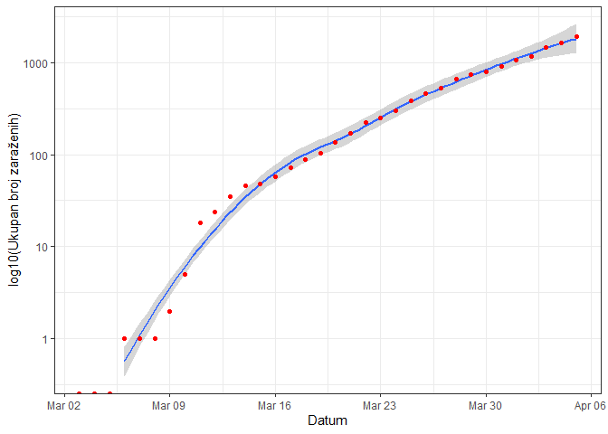

Ukupan pozitivnih broj u odnosu na dnevni rast pozitivnih slučajeva
-------------------------------------------------------------------

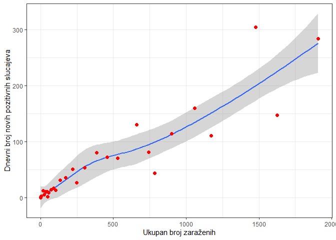

Dnevna promena rasta pozitivnih slučajeva
-----------------------------------------

crvena linija označava stopu rasta 1.1 puta

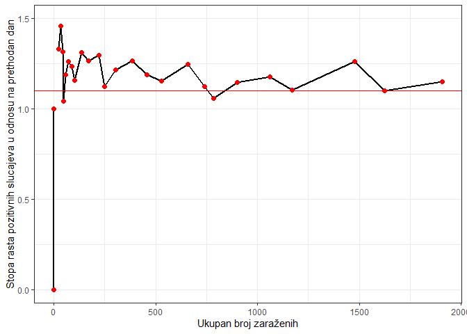

Promena broja pozitivnih slučajeva u odnosu na broj testiranih
--------------------------------------------------------------

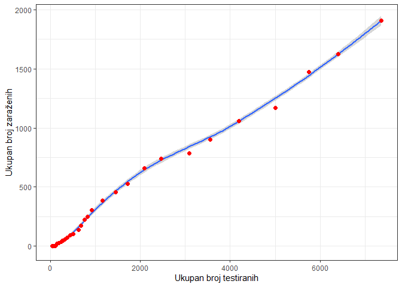

Promena broja testiranih slučajeva na dnevnom nivou
---------------------------------------------------

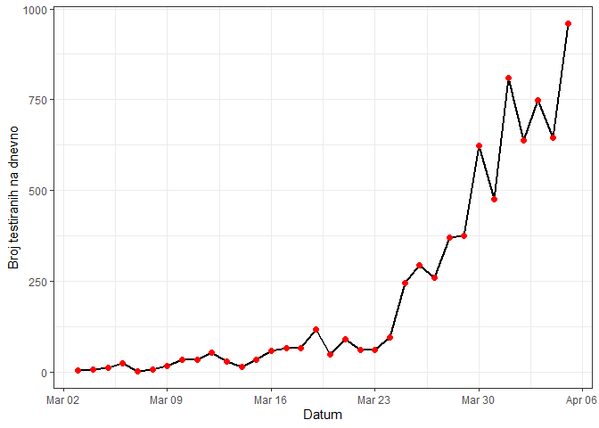

Odnos broja negativnih (crvena linija) broja pozitivnih slučajeva (zelena liniija)
----------------------------------------------------------------------------------

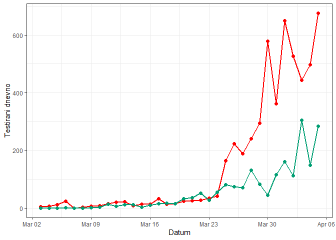

Procenat smrtnosti u zavisnosti od promene broja pozitivnih slučajeva
---------------------------------------------------------------------

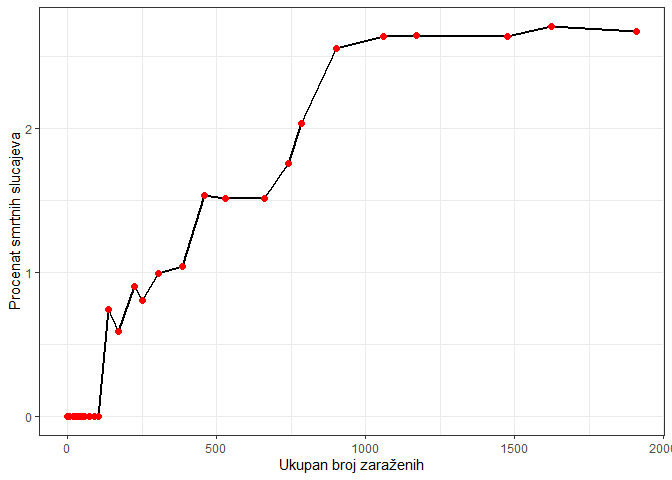

Starosna i polna struktura smrtnih slučajeva
--------------------------------------------

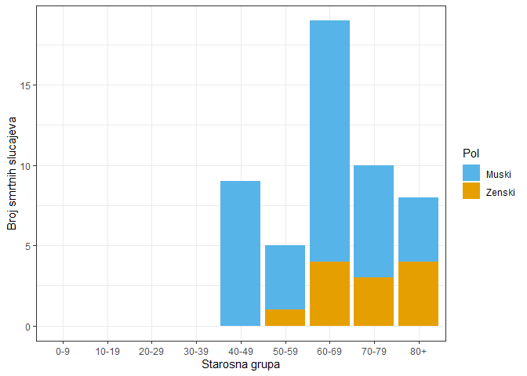

Broj povrđenih slučajeva u regionu
==================================

izvori: covid19.rs, worldometers.info,
<https://gisanddata.maps.arcgis.com/apps/opsdashboard/index.html#/bda7594740fd40299423467b48e9ecf6>

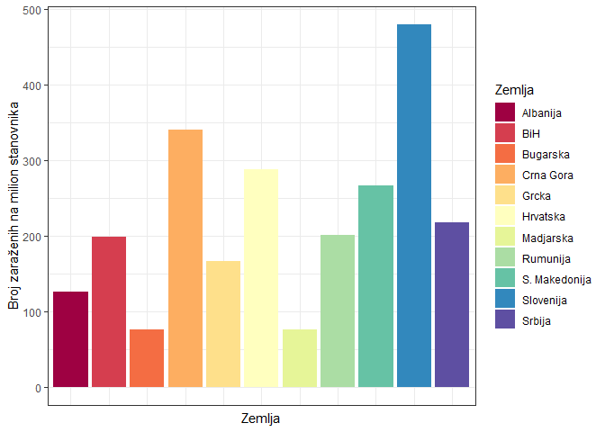

Broj smrtnih slučajeva u regionu
--------------------------------

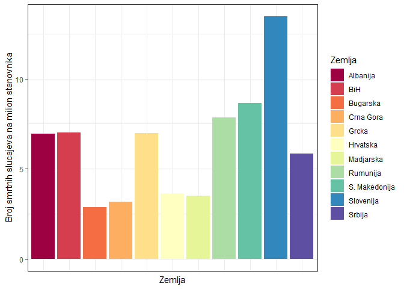

Rast broja zaraženih u odnosu na trenutna žarišta u Evropi (do 5. Aprila 2020)
------------------------------------------------------------------------------

Krugovi predstavljaju momenat uvođenja restrikcija/vanrednog stanja u
prikazanim zemljama izvori: covid19.rs, worldometers.info, swissinfo.ch

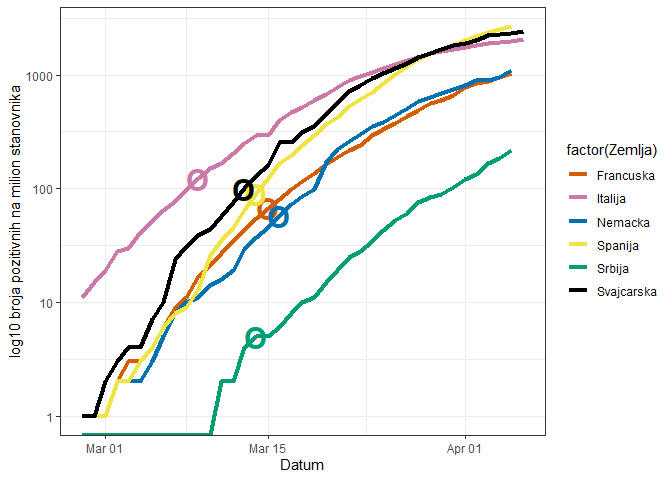
